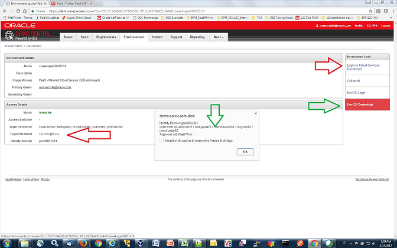

# Introduction #

This is repository that contains labs material for Cloud Native XWeeks.

## Important to verify before you start ##

##### NETWORK SETTINGS

+ If you make your lab **outside Oracle Network**, please **don't use VPN!**
+ If you make your lab inside Oracle Network infrastructure please don't utilize the network dedicated to non-Oracle employees. Please **configure the proxy settings** properly using [this guide](common/proxy.settings.md). Please note while you work with VM it is not recommended to change network on the host - every time you do so you need to restart the VM or it's network layer.

----

#### BEFORE YOU START

Please collect following data - we will use two different identity domains during the labs so please collect following:

+ DevCS Identity domain (referred as **DEVCS_DOMAIN**) 
+ DevCS User(s) (**DEVCS_USER**) - *cloud.adminXX*
+ DevCS Password (**DEVCS_PWD**) - belongs to *cloud.adminXX*
+ ACCS Identity domain (**ACCS_DOMAIN**)
+ ACCS User(s) (**ACCS_USER**) - *cloud.admin*
+ ACCS Password (**ACCS_PWD**) - belongs to *cloud.admin* 

The diagram below shows how to find DevCS domain (GREEN ARROW) and ACCS domain (RED ARROW)

----
### Lab 1-4 ###
+ [Cloud Native DevOps workshop](cloud-native-devops/README.md)

### Lab 5 ###

+ [Deploy complex cloud environment using Oracle Cloud Stack Manager](stack/README.md)

### Lab 6 ###

####Integrate telemetry into continuous delivery and monitor an application using the Oracle Management Cloud ####

+ [Create Oracle Developer Cloud Service project for SpringBoot application](springboot-sample/create.devcs.project.md)
+ [Create continuous build integration using Oracle Developer Cloud Service and Oracle Application Container Cloud Service](springboot-sample/devcs.accs.ci.md)
+ [Deploying APM Agent on Apache Tomcat based application and setting up Application Performance Monitoring](apm/README.md)

---

## [Contributing](CONTRIBUTING.md)
Pull Requests are currently not being accepted. See [CONTRIBUTING](CONTRIBUTING.md) for details.

## [License](LICENSE.md)
Copyright (c) 2014, 2016 Oracle and/or its affiliates
The Universal Permissive License (UPL), Version 1.0
