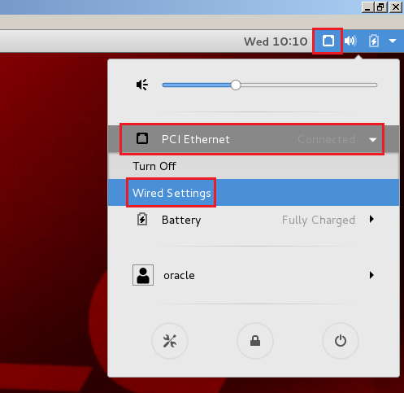
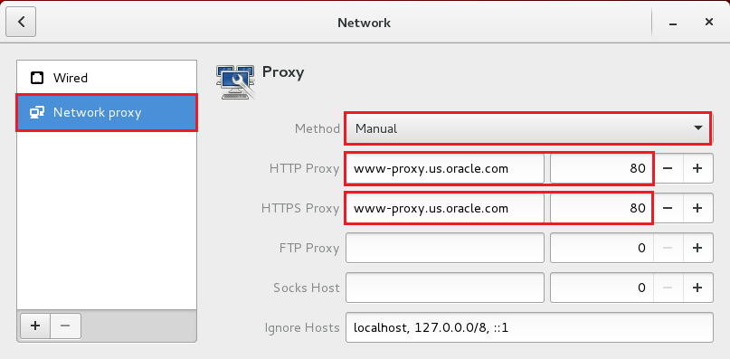
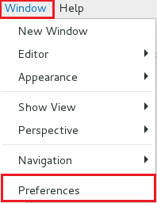
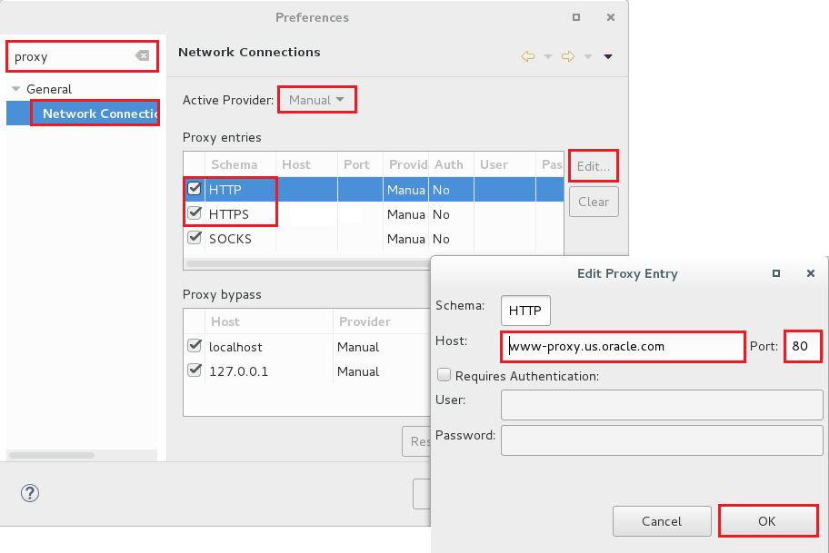
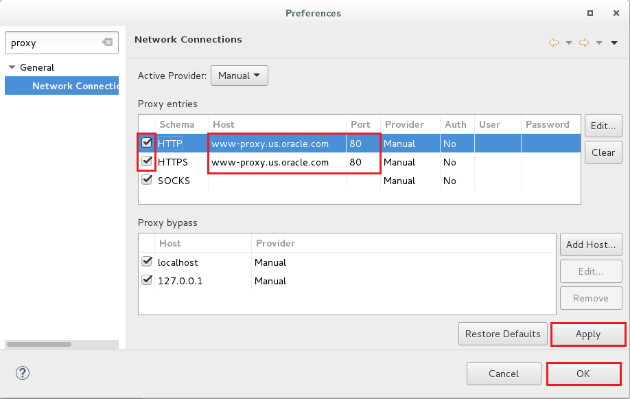
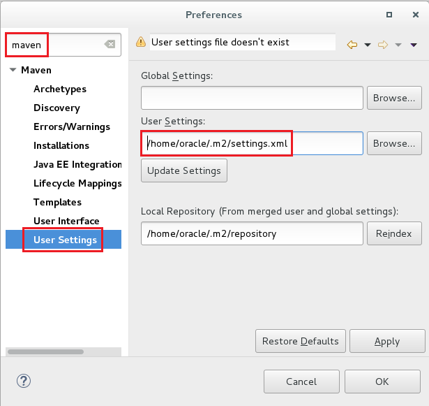

# ORACLE Cloud-Native DevOps workshop #
---
## Configure proxy ##

If you are running XWeek workshop behind a firewall and need to configure the proxy setting, there are several updates to be made. First, if you use the provided VirtualBox image you need to configure the guest OS network’s proxy settings, next you need to ensure that Eclipse’s proxy is set, then finally, you need to update the maven proxy settings.

Please keep in mind while you work with VM using VPN it is not recommended to change network on the host. Every time you do so you need to restart the VM or it's network layer.

### 1. Guest OS proxy settings

Click the Network icon on the toolbar available at top right. Select the **PCI Ethernet -> Wired Settings** menu item.

Select **Network proxy** and set the following values:

+ Method: Manual
+ HTTP Proxy: www-proxy.us.oracle.com 80
+ HTTPS Proxy: www-proxy.us.oracle.com 80

Finally close the Network configuration window.

This configuration enables guest OS's browser to connect to *cloud.oracle.com*.

### 2. Eclipse proxy settings

To set configure Eclipse’s proxy, open Eclipse and navigate to the Network Properties menu. This drop down is found from the **Window -> Preferences**.

From the preferences panel, enter *proxy* into the search window, and click on **Network Connections**. Select *Manual* for the **Active Provider**. Edit *HTTP* and *HTTPS* schema by selecting the entry and click **Edit** to configure. Both schema will have the same configuration:

+ Host: www-proxy.us.oracle.com
+ Port: 80
+ Requires Authentication: No

Confirm changes for *HTTP* and *HTTPS* schema details.

Finally click Apply + OK on Network Connection properties.

### 3. Maven proxy settings

From the **Window -> Preferences** panel, enter *Maven* into the search box. Click on the Maven **User Settings**. Make note of the directory where the *settings.xml* file is to be located. In the example below, the Maven **User Settings** are to be located in the */home/oracle/.m2* directory.

Close Eclipse.

If the directory does not exist where the *settings.xml* file is to be located, create the directory. In this example, we will create the *.m2* directory. Also, create the *settings.xml * file, if it does not exist. Open a terminal:

	[oracle@localhost Desktop]$ mkdir ~/.m2
	[oracle@localhost Desktop]$ vi ~/.m2/settings.xml

Type "i" to change edit mode. Add the following to the *settings.xml* file:

	<?xml version="1.0" encoding="UTF-8"?>
	<settings xmlns="http://maven.apache.org/SETTINGS/1.1.0"
		xmlns:xsi="http://www.w3.org/2001/XMLSchema-instance"
		xsi:schemaLocation="http://maven.apache.org/SETTINGS/1.1.0 http://maven.apache.org/xsd/settings-1.1.0.xsd">
		<proxies>
			<proxy>
				<active>true</active>
				<id>http_proxy</id>
				<protocol>http</protocol>
				<host>www-proxy.us.oracle.com</host>
				<port>80</port>
				<nonProxyHosts>localhost|127.0.0.1</nonProxyHosts>
			</proxy>
			<proxy>
				<active>true</active>
				<id>https_proxy</id>
				<protocol>https</protocol>
				<host>www-proxy.us.oracle.com</host>
				<port>80</port>
				<nonProxyHosts>localhost|127.0.0.1</nonProxyHosts>
			</proxy>
		</proxies>
	</settings>

Hit **Esc** button and type "wq!" to save changes.

Reload Eclipse to use the new maven settings.