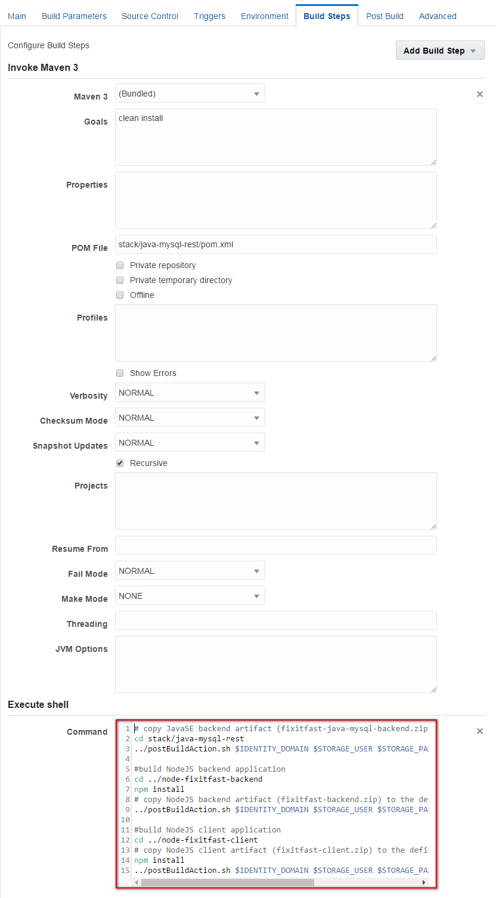

## Deploy complex cloud environment using Oracle Cloud Stack Manager ##

### About this tutorial ###
Oracle Cloud Stack Manager is a feature of Oracle Cloud that allows for the provisioning of multiple services within the Oracle Cloud. In order to build and deploy their applications, businesses often require sophisticated environments that consist of multiple, integrated cloud services. Consider a development environment whose needs include a Java application server along with a relational database. Provisioning each of these services for every member of your development team is time consuming and error prone, regardless of whether you’re using service consoles or REST APIs to provision the services. Oracle Cloud Stack Manager uses templates to provision a group of services (called a stack) and in the correct order.

In this tutorial you will learn how to quickly provision a group of related Oracle Cloud resources with Oracle Cloud Stack Manager.
You will use Cloud Stack Manager and a custom Oracle stack template to provision Oracle MySQL Cloud Service instance and multiple Oracle Application Container Cloud Services.

The FixItFast Cloud Native Applications requires the following services:

- MySQL Database service for customer data
- JavaSE (Spring Boot) REST service to access customer data persisted by MySQL Database service
- NodeJS REST Service to persist FixItFast application's data
- NodeJS Server to host front end (JavaScript) application

This tutorial demonstrates how to:

- create Oracle Developer Cloud Service project using existing external Git repository
- configure build job to build multiple services required by Cloud Native Application
- create and import custom Stack Template
- create Stack instance using Stack Template

### Prerequisites ###

- A valid identity domain, username and password for Oracle Cloud
- A subscription for Oracle MySQL Cloud Service and Application Container Cloud Service

----

#### Create Oracle Developer Cloud Service project ####

Sign in to [https://cloud.oracle.com/sign-in](https://cloud.oracle.com/sign-in). First select your datacenter then provide the identity domain and credentials. After a successful login you will see your Dashboard. Find the Developer services tile and click the hamburger icon. In the dropdown menu click **Open Service Console** to open Oracle Developer Cloud Services console.

Click **+ New Project** button to create a new project.

Enter *fixitfast* as name of the project, a desired description and Click **Next**.

Click **Next** and select *Initial Repository* as template.

Click **Next** and on the Properties page select *MARKDOWN* as Wiki Markup and select *Import existing repository* to copy existing repository in this new project. Enter or copy the *https://github.com/oracle-weblogic/cloud-native-XWeeks.git* repository address.

Now click **Finish** to create the project and to clone the specified repository.

### Configure build job to produce FixItFast sample application's components ###

Once the project provisioning is ready let's create the build job to compile and packaging all necessary components for FixItFast Cloud Native application.

Select **Build** item on the left side menu and click the **New Job** button.

Enter a name e.g. *FixItFast-build-all-components* for the new job. Select the *Create a free-style job* option and click **Save**.

On the Main configuration page of the newly created job make sure **JDK 8** is the selected JDK.

Change to the **Build Parameters** tab and select the **This build is parameterized** option. Click the **Add Parameter** button and for first select **String Parameter**. 

When the details area appears enter the following values below. Note you need to click **Add Parameter** for each value-pair. In case of password parameter select **Password Parameter**.

- **Type**:String Parameter, **Name**: STORAGE_USER, **Default Value**: your Oracle Public Cloud account's username
- **Type**:Password Parameter, **Name**: STORAGE_PASSWORD, **Default Value**: your Oracle Public Cloud account's password
- **Type**:String Parameter, **Name**: STORAGE_CONTAINER, **Default Value**: xweek
- **Type**:String Parameter, **Name**: IDENTITY_DOMAIN, **Default Value**: your Oracle Public Cloud identity domain

When you have all the necessary parameters it should look similar like below, expect the default values. To give default values here is just an option, you can define the correct values when the build job will be started.

 

Now change to the **Source Control** tab and select **Git**. In the git's properties section select the only one available Git repository which is provided in the list. Leave the advanced settings default.

Change to **Build Steps** tab and add **Maven 3** build step for the first, JavaSE backend service component. 

Make sure the **Goals** are *clean install* and enter *stack/java-mysql-rest/pom.xml* to **POM File** field. Leave default for the rest.

The rest of the build tasks (the 2 NodeJS components build and to copy artifacts to storage container) will be executed as shell script, thus add an Execute Shell as a second build step.

Scroll down to Command text area and copy or enter the commands below.
	
	# copy JavaSE backend artifact (fixitfast-java-mysql-backend.zip) to the defined cloud storage location
	cd stack/java-mysql-rest
	../postBuildAction.sh $IDENTITY_DOMAIN $STORAGE_USER $STORAGE_PASSWORD $STORAGE_CONTAINER
	
	#build NodeJS backend application
	cd ../node-fixitfast-backend
	npm install
	# copy NodeJS backend artifact (fixitfast-backend.zip) to the defined cloud storage location
	../postBuildAction.sh $IDENTITY_DOMAIN $STORAGE_USER $STORAGE_PASSWORD $STORAGE_CONTAINER
	
	#build NodeJS client application
	cd ../node-fixitfast-client
	# copy NodeJS client artifact (fixitfast-client.zip) to the defined cloud storage location
	npm install
	../postBuildAction.sh $IDENTITY_DOMAIN $STORAGE_USER $STORAGE_PASSWORD $STORAGE_CONTAINER

Quick explanation to the script. As you can see from the comments the script first copies the previous Maven build's result to the storage. The second part builds the NodeJS backend application then copies that to the same storage location. Finally the last part builds again a NodeJS, but now the client component and copies to the defined storage location. Basically NodeJS build requires *npm install* which downloads the dependencies and archive the result to a single zip file. The *postBuildAction.sh* script simply copies any archived artifact in given folder to the cloud storage location using *curl* and defined build parameters.

To archive artifact in Developer Cloud Service too, change to **Post Build** tab and check in the **Archive the artifacts** option. Enter **\**/\*.zip** into **Files To Archive** field. Finally click **Save** to update the new job configurations.

Now execute the new build job. The previous step result navigated to the *FixItFast-build-all-components* detail page. Click **Build Now**.

The parameters dialog appears. If the default values are correct then click **Build** and wait until the build completed. Note the container name has to be *xweek*, but the rest of the parameters need to reflect your cloud environment. 

  
If the build succeded you can find a green tick at the status field in the Build History. You can download the archived artifacts, but now it is not necessary. During the build or later anytime you can check the console output of the build process. Click on **Console** icon to review the log.

In case of build failure you can find the problem easily here in the log. If the build was successful then you can find *Finished: SUCCESS* entry at the end of the log.

### Import custom Stack template to Oracle Cloud Stack Manager ###

